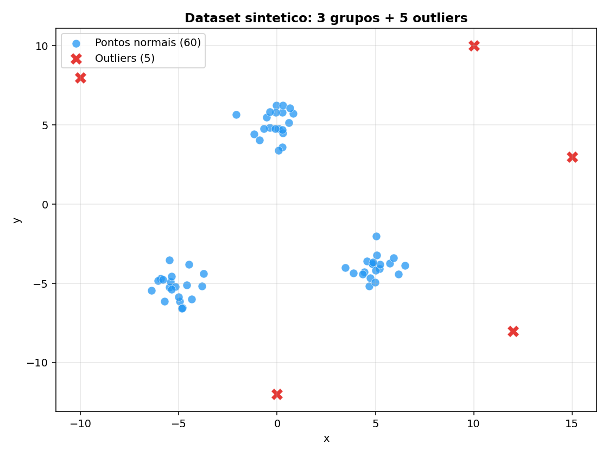
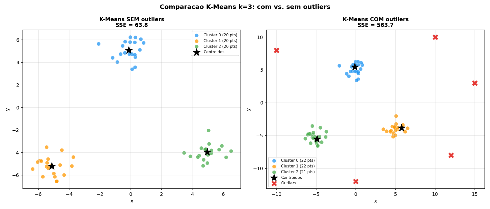
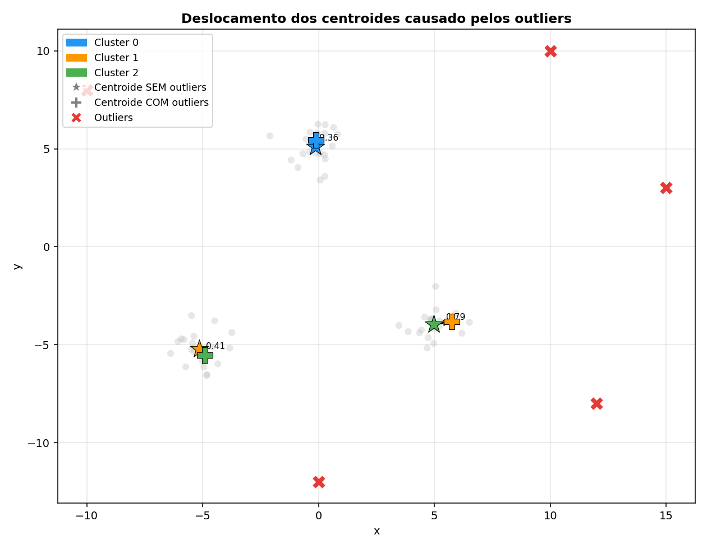
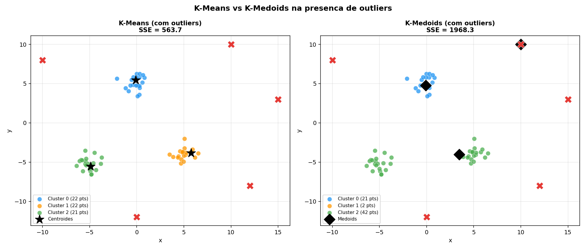

# Relatório – Algoritmos Particionais (Parte 2)
## Influência de Outliers no K-Means e Comparação com K-Medoids

## Integrantes

- André Luiz Vicente Silva
- Ruan Pablo de Assis Neres

---

## Objetivo

Aplicar o algoritmo K-Means com k=3 em duas situações distintas — com e sem outliers — e analisar como esses pontos extremos afetam os centróides, o SSE/Inertia e a distribuição dos clusters. Ao final, discutir se o K-Medoids ofereceria uma solução mais robusta.

---

## Dataset utilizado

**Dataset sintético "Blobs com Outliers"** gerado com `make_blobs` do scikit-learn.

| Característica       | Valor               |
|----------------------|---------------------|
| Total de pontos      | 65                  |
| Pontos normais       | 60                  |
| Outliers             | 5                   |
| Atributos            | `x` e `y` (2D)     |
| Grupos naturais      | 3 (centros definidos) |
| Dispersão (`std`)    | 0.8                 |
| Centros dos grupos   | (-5, -5), (0, 5), (5, -4) |

Os 5 outliers foram inseridos manualmente nas posições:
`(10, 10)`, `(12, -8)`, `(-10, 8)`, `(0, -12)`, `(15, 3)`.

### Visualização inicial

---

## Experimentos realizados

### Experimento 1 – K-Means SEM outliers (k = 3)

Foram utilizados apenas os 60 pontos classificados como normais.

| Métrica           | Valor                         |
|-------------------|-------------------------------|
| Pontos analisados | 60                            |
| SSE (Inertia)     | **63.85**                     |
| Distribuição      | C0: 20 \| C1: 20 \| C2: 20   |

**Centróides encontrados:**

| Cluster | x        | y        |
|---------|----------|----------|
| C0      | -0.1360  | 5.0896   |
| C1      | -5.1409  | -5.2089  |
| C2      | 4.9768   | -3.9606  |

> Os centróides ficaram muito próximos dos centros reais dos grupos definidos
> na geração: (-5, -5), (0, 5) e (5, -4). Distribuição perfeitamente
> equilibrada: 20 pontos por cluster.

---

### Experimento 2 – K-Means COM outliers (k = 3)

Foram utilizados todos os 65 pontos (60 normais + 5 outliers).

| Métrica           | Valor                         |
|-------------------|-------------------------------|
| Pontos analisados | 65                            |
| SSE (Inertia)     | **563.74**                    |
| Distribuição      | C0: 22 \| C1: 22 \| C2: 21   |

**Centróides encontrados:**

| Cluster | x        | y        |
|---------|----------|----------|
| C0      | -0.1237  | 5.4451   |
| C1      | 5.7517   | -3.8278  |
| C2      | -4.8961  | -5.5323  |

---

### Experimento 3 – K-Medoids COM outliers (k = 3)

Algoritmo PAM implementado sem biblioteca externa. O medoid é sempre um
**ponto real do dataset**, nunca uma média aritmética.

| Métrica           | Valor                         |
|-------------------|-------------------------------|
| Pontos analisados | 65                            |
| SSE (calculado)   | **1968.30**                   |
| Distribuição      | C0: 21 \| C1: 2 \| C2: 42    |

**Medoids (pontos reais escolhidos como representantes):**

| Cluster | x        | y        |
|---------|----------|----------|
| M0      | -0.0925  | 4.7591   |
| M1      | 10.0000  | 10.0000  |
| M2      | 3.4650   | -4.0212  |

> O K-Medoids isolou os outliers em um cluster próprio (C1, apenas 2 pontos),
> elegendo o outlier `(10, 10)` como medoid desse grupo. Os clusters C0 e C2
> mantiveram medoids centrais em relação aos seus grupos naturais.

---

## Visualizações comparativas

### Comparação K-Means: sem vs. com outliers

### Deslocamento dos centróides

### K-Means vs. K-Medoids (com outliers)

---

## Tabela comparativa final

| Cenário                   | Pontos | SSE / Inertia | Distribuição (C0 \| C1 \| C2) |
|---------------------------|--------|---------------|-------------------------------|
| K-Means **sem** outliers  | 60     | **63.85**     | 20 \| 20 \| 20                |
| K-Means **com** outliers  | 65     | **563.74**    | 22 \| 22 \| 21                |
| K-Medoids **com** outliers| 65     | 1968.30 ¹     | 21 \| 2 \| 42                 |

> ¹ O SSE do K-Medoids é calculado sobre medoids (pontos reais), não sobre médias
> ideais, o que explica o valor absoluto maior. A métrica relevante para o
> K-Medoids é a **robustez dos representantes**, não a minimização do SSE.

---

## Análise e respostas às questões

### 1. Os centróides mudaram?

**Sim.** Ao incluir os 5 outliers, todos os três centróides foram deslocados:

| Cluster | Deslocamento |
|---------|-------------|
| C2      | **0.7861**  |
| C1      | 0.4056      |
| C0      | 0.3557      |

O deslocamento médio foi de **≈ 0.52 unidades**. O centróide C2 (grupo inferior
direito) foi o mais afetado, puxado pelos outliers `(12, -8)` e `(15, 3)` que
ficaram próximos geograficamente desse cluster. O fenômeno confirma a teoria da
Aula 6: o centróide é a **média aritmética** de todos os pontos do cluster e,
portanto, um único ponto extremo já é suficiente para deslocá-lo.

### 2. O SSE aumentou?

**Sim, de forma expressiva.**

$$\text{SSE}_{\text{sem outliers}} = 63{,}85 \quad \xrightarrow{\text{+5 outliers}} \quad \text{SSE}_{\text{com outliers}} = 563{,}74$$

O aumento foi de **+783%**, ou seja, o SSE ficou aproximadamente **9× maior**.
Isso acontece porque os outliers estão muito distantes dos centróides dos grupos
normais. A distância quadrática de cada outlier ao centróide mais próximo é
elevada, e o K-Means tentando minimizar a soma total é forçado a criar centróides
num ponto intermediário entre os dados normais e os pontos extremos, piorando a
qualidade global dos grupos.

### 3. Algum grupo ficou distorcido?

**Sim.** Observa-se que os outliers foram **distribuídos entre os três clusters
existentes** em vez de formarem um grupo próprio. O K-Means não consegue detectar
"anomalias": cada ponto é obrigado a pertencer a algum cluster. Consequência:

- Os centróides se afastam dos centros naturais dos grupos;
- Pontos de borda entre dois grupos naturais podem migrar de cluster;
- A interpretabilidade dos grupos diminui.

### 4. O K-Means foi robusto a outliers?

**Não.** O K-Means é **sensível a outliers** por definição, pois o centróide é
calculado como a média de todos os pontos do cluster. Um único ponto com
coordenadas extremas eleva a contribuição ao SSE e desloca o centróide para fora
do "núcleo" do grupo. Com apenas 5 outliers em 65 pontos (≈ 7,7% dos dados), o
SSE aumentou 783%. Em dados reais com proporção maior de anomalias, o impacto
seria ainda mais severo.

### 5. O K-Medoids seria melhor?

**Em termos de robustez dos representantes, sim.**

| Aspecto                    | K-Means            | K-Medoids           |
|----------------------------|--------------------|---------------------|
| Representante do cluster   | Média aritmética   | Ponto real do dataset |
| Sensibilidade a outliers   | Alta               | Menor               |
| Outliers formam cluster próprio | Não (dispersos) | Sim (isolados)    |
| Custo computacional        | O(n·k·i)           | O(n²·k·i)           |
| SSE mínimo garantido       | Sim (ótimo local)  | Não (SSE maior)     |

No experimento realizado, o K-Medoids **isolou os outliers em um cluster próprio**
(apenas 2 pontos, com medoid em `(10, 10)`), enquanto os clusters C0 e C2 mantiveram
medoids que representam fielmente os grupos naturais. Isso demonstra a vantagem
central do K-Medoids: o representante é sempre um **objeto real e observado**,
logo não pode ser "puxado" para fora do espaço dos dados normais.

A desvantagem é que o SSE absoluto tende a ser maior (medoids não minimizam a
soma quadrática tão bem quanto médias) e o algoritmo PAM tem complexidade O(n²),
o que o torna mais lento para datasets grandes.

**Conclusão sobre K-Medoids:** é preferível quando:
- Há presença confirmada de outliers ou ruído no dataset;
- O representante do grupo precisa ser um **caso real** (interpretável);
- O dataset é de tamanho moderado (centenas a poucos milhares de pontos).

---

## Conclusão geral

O experimento demonstrou de forma clara os efeitos que outliers exercem sobre o
K-Means:

1. **Deslocamento dos centróides** — os representantes dos grupos se afastam dos
   centros naturais das nuvens de pontos, tornando-os menos representativos;
2. **Explosão do SSE** — o valor da função objetivo aumentou 783% com apenas
   7,7% de dados anômalos;
3. **Distorção dos grupos** — outliers são absorvidos pelos clusters existentes,
   podendo misturar pontos de grupos naturais diferentes;
4. **Ausência de detecção de anomalias** — o K-Means não identifica nem isola
   outliers; todos os pontos recebem um rótulo de cluster.

O **K-Medoids** apresentou maior robustez ao isolar os outliers, mas com custo
computacional maior e SSE absoluto mais alto. A escolha entre os dois algoritmos
deve considerar: quantidade de outliers esperada, necessidade de interpretabilidade
dos representantes e tamanho do dataset.

---

## Arquivos gerados

| Arquivo | Descrição |
|---------|-----------|
| `dataset_blobs_com_outliers.csv` | Dataset sintético com 65 pontos |
| `saida_visualizacao/01_dataset_inicial.png` | Visualização dos pontos normais e outliers |
| `saida_visualizacao/02_comparacao_kmeans.png` | K-Means sem vs. com outliers |
| `saida_visualizacao/03_deslocamento_centroides.png` | Setas de deslocamento dos centróides |
| `saida_visualizacao/04_kmeans_vs_kmedoids.png` | K-Means vs. K-Medoids |
| `saida_visualizacao/resumo_comparativo.csv` | Tabela numérica dos três cenários |
