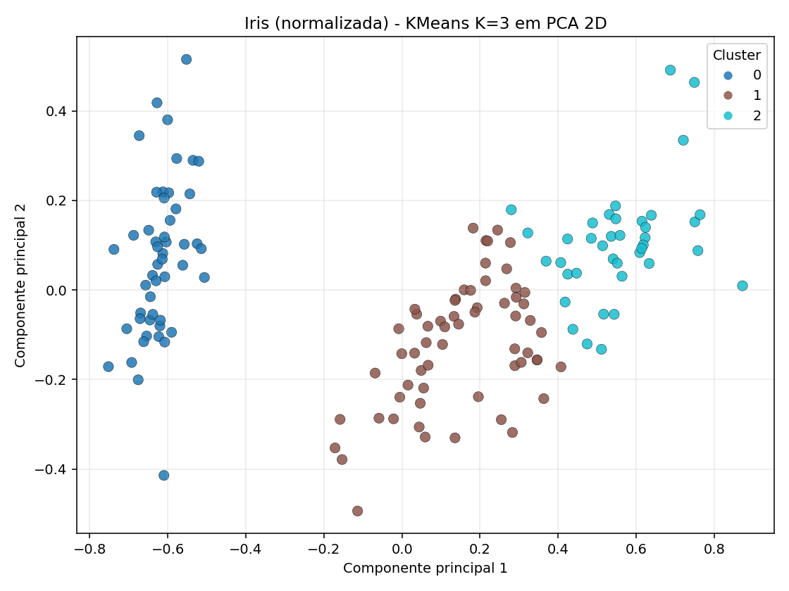
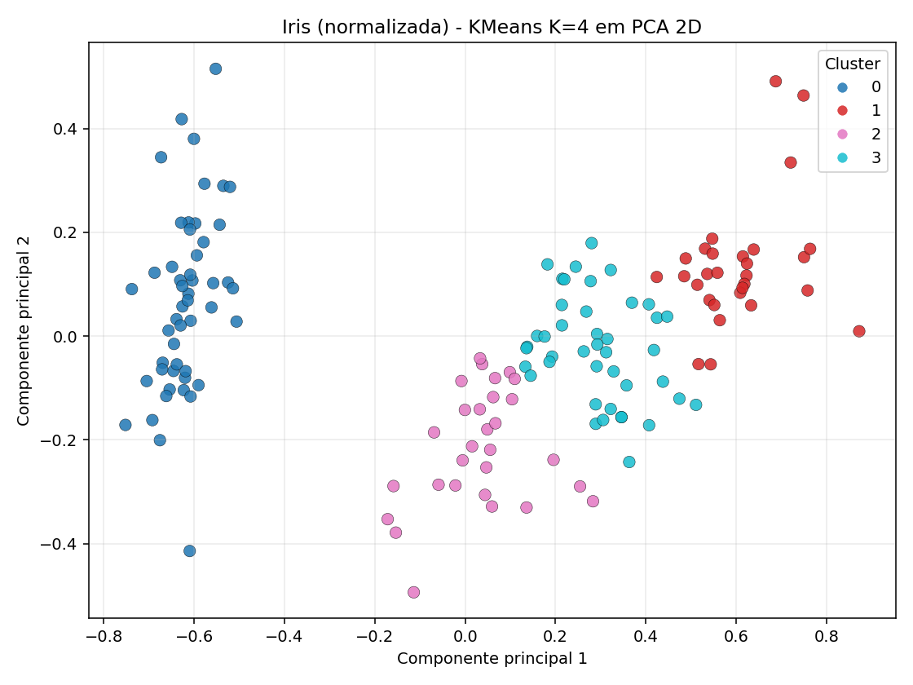
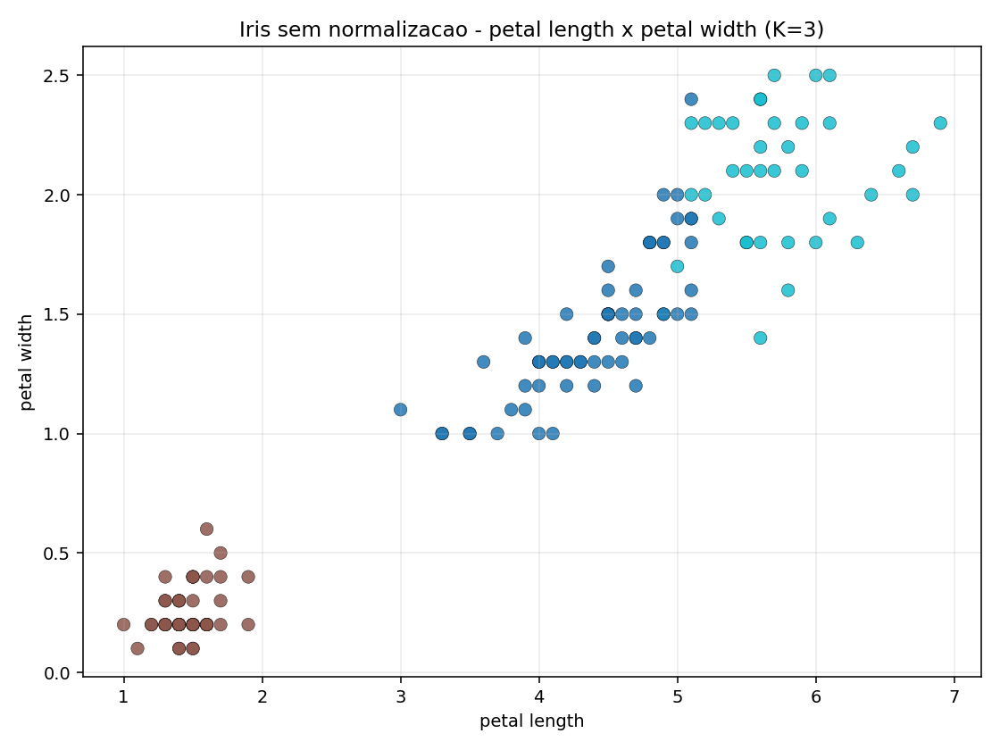
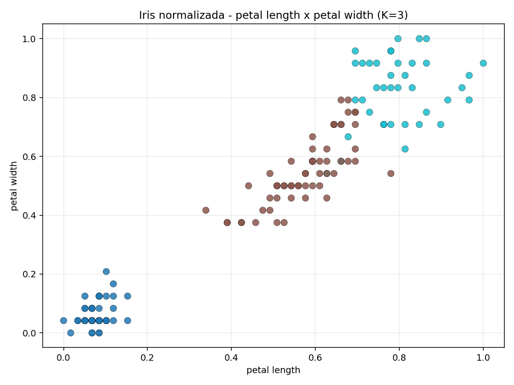

# Relatório - Algoritmos Particionais (K-Means na base Iris)

## Integrantes

- Nome 1:
- Nome 2:
- Nome 3:

## Objetivo

Aplicar o algoritmo particional K-Means na base Iris e analisar como o pré-processamento (normalização) e a escolha do valor de K influenciam os agrupamentos.

## Etapas realizadas

1. Carregamento da base Iris.
2. Verificação dos 4 atributos numéricos:
   - `sepal length (cm)`
   - `sepal width (cm)`
   - `petal length (cm)`
   - `petal width (cm)`
3. Aplicação de normalização Min-Max (escala de 0 a 1) em um experimento.
4. Execução do K-Means com `K = 3`.
5. Registro de:
   - número de grupos gerados;
   - centróides;
   - distribuição dos objetos por grupo.
6. Repetição do experimento:
   - sem normalização (K = 3);
   - com outro valor de K (K = 2 e K = 4, com normalização).

## Evidências visuais (alternativa ao Weka)

As imagens abaixo foram geradas automaticamente pelo script `analise_kmeans_iris.py`.

### Visualização 1 - PCA 2D com K = 3 (normalizado)

### Visualização 2 - PCA 2D com K = 4 (normalizado)

### Visualização 3 - Relação entre pétalas sem normalização (K = 3)

### Visualização 4 - Relação entre pétalas com normalização (K = 3)

### Tabela-resumo dos cenários

Arquivo gerado: `./saida_visualizacao/resumo_kmeans_iris.csv`

## Resultados obtidos

### Cenário 1 - Sem normalização (K = 3)

- Número de grupos: **3**
- Distribuição por grupo:
  - Cluster 0: **62**
  - Cluster 1: **50**
  - Cluster 2: **38**
- Centróides:
  - C0 = `[5.9016, 2.7484, 4.3935, 1.4339]`
  - C1 = `[5.0060, 3.4280, 1.4620, 0.2460]`
  - C2 = `[6.8500, 3.0737, 5.7421, 2.0711]`

### Cenário 2 - Com normalização (K = 3)

- Número de grupos: **3**
- Distribuição por grupo:
  - Cluster 0: **50**
  - Cluster 1: **61**
  - Cluster 2: **39**
- Centróides (escala 0 a 1):
  - C0 = `[0.1961, 0.5950, 0.0783, 0.0608]`
  - C1 = `[0.4413, 0.3074, 0.5757, 0.5492]`
  - C2 = `[0.7073, 0.4509, 0.7970, 0.8248]`

### Cenário 3 - Com normalização (K = 2)

- Número de grupos: **2**
- Distribuição por grupo:
  - Cluster 0: **100**
  - Cluster 1: **50**
- Centróides:
  - C0 = `[0.5450, 0.3633, 0.6620, 0.6567]`
  - C1 = `[0.1961, 0.5950, 0.0783, 0.0608]`

### Cenário 4 - Com normalização (K = 4)

- Número de grupos: **4**
- Distribuição por grupo:
  - Cluster 0: **50**
  - Cluster 1: **29**
  - Cluster 2: **29**
  - Cluster 3: **42**
- Centróides:
  - C0 = `[0.1961, 0.5950, 0.0783, 0.0608]`
  - C1 = `[0.7385, 0.4727, 0.8229, 0.8635]`
  - C2 = `[0.3563, 0.2371, 0.5091, 0.4713]`
  - C3 = `[0.5417, 0.3750, 0.6566, 0.6419]`

## Respostas às questões

### 1) Qual foi a diferença entre executar o K-Means com e sem normalização?

Com normalização, todos os atributos passam a contribuir em escala comparável (0 a 1), reduzindo o efeito de atributos com maior amplitude numérica. Na prática, os centróides mudam de posição e a distribuição entre grupos também varia (de 62/50/38 para 50/61/39 em K = 3), mostrando que o pré-processamento influencia diretamente o resultado do agrupamento.

### 2) O valor K = 3 parece adequado para a base Iris? Justifique.

Sim, K = 3 é adequado por refletir a estrutura conhecida de três espécies na base Iris. O agrupamento separa muito bem a espécie Setosa e organiza Versicolor e Virginica em grupos parcialmente sobrepostos, o que é coerente com a literatura sobre essa base.

### 3) Os grupos formados parecem coerentes com as características das flores?

Sim. A Setosa aparece bem isolada (medidas de pétala menores), enquanto Versicolor e Virginica apresentam sobreposição em parte das amostras, pois suas características morfológicas são mais próximas. Esse comportamento é esperado para o K-Means na Iris.

### 4) O que muda quando alteramos o valor de K?

- Com **K = 2**, o modelo junta Versicolor e Virginica em um mesmo grupo e separa basicamente a Setosa.
- Com **K = 4**, ocorre uma fragmentação maior dos dados, dividindo subestruturas (principalmente entre Versicolor/Virginica), com menor simplicidade interpretativa.
- Portanto, K controla o nível de granularidade dos agrupamentos.

### 5) Quais limitações do K-Means você percebeu na prática?

- É necessário definir K antecipadamente.
- Sensível à escala dos atributos (normalização pode ser essencial).
- Sensível à inicialização dos centróides.
- Assume grupos aproximadamente esféricos e de tamanho semelhante.
- Tem dificuldade quando há sobreposição forte entre classes naturais.

## Conclusão

O experimento mostrou que o K-Means é simples e eficiente para identificar padrões gerais na base Iris, mas seus resultados dependem fortemente das escolhas de pré-processamento e do valor de K. A normalização alterou a posição dos centróides e a distribuição dos objetos entre grupos, e a variação de K mudou o nível de detalhamento dos agrupamentos. Assim, apesar de ser um algoritmo útil para análise exploratória, sua aplicação exige validação cuidadosa e interpretação contextual dos resultados.
